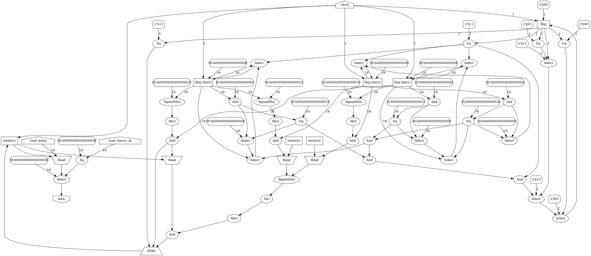

# Exprgrad FPGA Prototype

A prototype of an FPGA backend for [exprgrad](https://github.com/can-lehmann/exprgrad).
It was written in about two weeks in order to assess the feasability of an efficient FPGA backend for exprgrad and explore architectures for its implementation.

## How does it work?

The basic idea is to compile instructions without side-effects directly to combinatorial logic while tensor reads/writes and loops are compiled to sequential logic.
Multiple kernels are handled by a global state machine which controls which kernel is currently active.
Scalar values are represented by fixed point numbers.

Let's look at how a simple matrix multiplication example is compiled to a hardware description.

First a user implements the matrix multiplication operation using exprgrad's domain specific language.
The resulting model (= program containing the kernel and inputs, parameters, ...) is saved to disk.

```nim
import exprgrad, exprgrad/io/serialize

proc matmul(a, b: Fun): Fun =
  result[y, x] ++= a[y, it] * b[it, x] | (x, y, it)

let model = compile[float32](matmul(input("a"), input("b")).target("matmul"))
model.save("matmul.bin")
```

The user now calls the `model2fpga` program found in the tools folder.


```bash
./model2fpga \
  -i a 2x3 "1,2,3,4,5,6"  `# Input tensor a`\
  -i b 3x2 "1,2,3,4,5,6"  `# Input tensor b`\
  -S "8.8"                `# Fixed point format for Scalar type`\
  -I 16                   `# Number of bits in Index type`\
  -p                      `# Print IR to stdout`\
  -g graph.gv             `# Output circuit graph`\
  -f                      `# Flash bitstream to FPGA using fujprog`\
  -t matmul               `# Name of target to compile`\
  -l ulx3s.lpf            `# LPF file for nextpnr`\
  matmul.bin              `# Path to model`\
```

The `model2fpga` tool now loads the saved model from disk and runs a slightly modified version of exprgrad's standard compilation pass pipeline.
The resulting intermediate representation looks like this:

```
tensor1 = input(a)
tensor2 = input(b)
matmul tensor0:
  kernel:
    nested_loops reg0 in 0 to 2,
                 reg1 in 0 to 3,
                 reg3 in 0 to 2:
      reg2 = read[tensor1]((reg1 + (reg0 * 3)))
      reg4 = read[tensor2]((reg3 + (reg1 * 2)))
      write[tensor0]((reg3 + (reg0 * 2)), (reg2 * reg4))
```

This intermediate representation is now used to generate a circuit consisting of registers, memories and combinatorial logic.
The circuit is represented as a graph where each edge represents a wire between two components.
A circuit may contain cycles when at least one component in the cycle is a register or memory.
Cycles within combinatorial logic are not allowed.

A loop is implemented as a counter which increments when the inner loop has finished iterating over its domain.
If a loop is the innermost loop, it increements on each clock cycle if the kernel is active.
When all loops of a kernel have iterated over their domain, the next kernel may perform its computation.

In this case the resulting circuit graph looks like this:



In order to allow the user to interact with the model while it is running on an FPGA, a series of wrapper circuits is applied to the model circuit.
The resulting composite of circuits is now compiled to a verilog file where each module corresponds to one subcircuit.

The resulting Verilog code can be seen [here](docs/matmul.v).

## XOR Example

The prototype backend is already able to synthesize logic circuits for a small subset of exprgrad programs.
To demonstrate this, a simple XOR neural network built from **unmodified** exprgrad DNN layers is compiled to a logic circuit.

```nim
import std/random
import exprgrad, exprgrad/io/serialize, exprgrad/layers/[base, dnn]
randomize(10)

let
  net = input("x")
    .dense(2, 4).leaky_relu() # 1st Layer
    .dense(4, 1).leaky_relu() # 2nd Layer
    .target("predict")
    .mse(input("y"))          # Loss
    .target("loss")
    .backprop(gradient_descent.make_opt(rate=0.1)) # Train
    .target("train")
  model = compile[float64](net)

let
  train_x = new_tensor([4, 2], @[float64 0, 0, 0, 1, 1, 0, 1, 1])
  train_y = new_tensor([4, 1], @[float64 0, 1, 1, 0])

for epoch in 0..<5000:
  model.apply("train", {"x": train_x, "y": train_y})

echo model.call("predict", {"x": train_x})
model.save("model.bin")
```

The network is similar to the one shown in the exprgrad README, except for that it uses a ReLU after the 2nd layer instead of a sigmoid activation.
Sigmoids are not supported by the prototype backend, since a general solution for synthesizing exponential functions would require automatically creating lookup tables which (while it is simple) is outside of the scope of this prototype.

Compiling this model using

```bash
./model2fpga -i x 4x2 "0,0,0,1,1,0,1,1" -S "8.8" -I 16 -p -v output.v -f -t predict -l ulx3s.lpf model.bin
```

results in the network correctly predicting the inputs directly on the FPGA.

### Trainig on the FPGA

Since exprgrad expands the backwards passes for training neural networks to a series of kernels, it is also possible to train the network directly on the FPGA.

The 16bit fixed point number representation used in the previous examples is however not precise enough.
Switching to 24bit fixed point numbers with 16bits after the point solves this issue.
Additionally a "mainloop" must be added to the program in order to enable executing targets multiple times.

```bash
./../../tools/model2fpga \
  -i x 4x2 "0,0,0,1,1,0,1,1" \
  -i y 4x1 "0,1,1,0" \
  -S "8.16"                 `# Use 24bit fixed point numbers`\
  -I 16 \
  -p \
  -V output.v               `# Do not add wrapper circuits`\
  -t predict \
  -t train \
  -m                        `# Add a mainloop`\
  model.bin
```

The mean squared error used in the model includes a division operation.
Since the FPGA backend is currently unable to synthesize divisions, a constant propagation pass was added to the compilation pipeline which replaces divisions by constant divisors with multiplications by the inverse of these divisors.

A custom wrapper ui circuit is used to enable the user to trigger the training process by pressing a button.

```verilog
module main(input clk_25mhz, input [6:0] btn, output [7:0] led, output wifi_gpio0);
  assign wifi_gpio0 = 1'b1;
  
  wire [23:0] data;
  wire [15:0] read_index;
  assign read_index = (btn[5] ? 2 : 0) | (btn[6] ? 1 : 0);
  mod0 __mod0(clk_25mhz, {15'b0, btn[3]}, 3, read_index, data); // Instance of the model circuit
  assign led = btn[2] ? data[23:16] : (btn[1] ? data[15:8] : data[7:0]);
endmodule
```

## Future Work

These are some features which are not implemented in this prototype, but are important for the final implementation in exprgrad itself.

- High level circuit intermediate representation
- Parallel execution of kernels
- Storing tensors in external RAM
- Scheduling language
  - Loop unrolling
  - Loop fusion (exprgrad already implements this for CPU/GPU)
  - Pipelining
  - Lookup tables

## Development Board

The FPGA backend prototype is currently only compatible with the [ULX3S](https://github.com/emard/ulx3s) development board and the ECP5 85 FPGA.
It uses the yosys/nextpnr/fujprog toolchain.

## Contributing

This project does not accept contributions, since it is a prototype intended for learning about how an actual implementation of FPGA support in exprgrad might look like.
Please contribute to the [main exprgrad repository](https://github.com/can-lehmann/exprgrad) instead.
If you are interested in working on FPGA support for exprgrad, please [open an issue on the main exprgrad repository](https://github.com/can-lehmann/exprgrad/issues/new).

## License

Copyright 2021 - 2022 Can Joshua Lehmann

Licensed under the Apache License, Version 2.0 (the "License");
you may not use this file except in compliance with the License.
You may obtain a copy of the License at

  http://www.apache.org/licenses/LICENSE-2.0

Unless required by applicable law or agreed to in writing, software
distributed under the License is distributed on an "AS IS" BASIS,
WITHOUT WARRANTIES OR CONDITIONS OF ANY KIND, either express or implied.
See the License for the specific language governing permissions and
limitations under the License.
