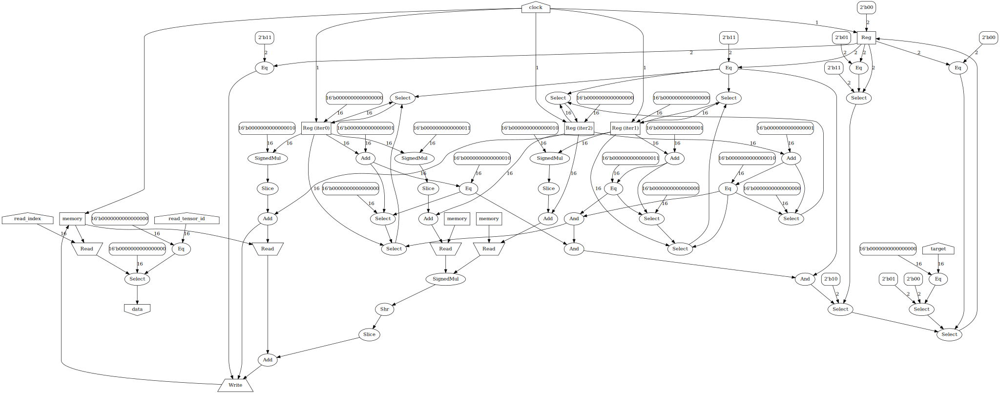

# Exprgrad FPGA Prototype

A prototype for an FPGA backend for [exprgrad](https://github.com/can-lehmann/exprgrad).

## How does it work?

The basic idea is to compile instructions without side-effects directly to combinatorial logic while tensor reads/writes and loops are compiled to sequential logic.
Multiple kernels are handled by a global state machine which controls which kernel is currently active.
Scalar values are represented by fixed point numbers.

Let's look at how a simple matrix multiplication example is compiled to a hardware description.

First a user implements the matrix multiplication operation using exprgrad's domain specific language.
The resulting model (= program containing the kernel and inputs, parameters, ...) is saved to disk.

```nim
import exprgrad, exprgrad/io/serialize

proc matmul(a, b: Fun): Fun =
  result[y, x] ++= a[y, it] * b[it, x] | (x, y, it)

let model = compile[float32](matmul(input("a"), input("b")).target("matmul"))
model.save("matmul.bin")
```

The user now calls the `model2fpga` program found in the tools folder.


```bash
./model2fpga \
  -i a 2x3 "1,2,3,4,5,6"  `# Input tensor a`\
  -i b 3x2 "1,2,3,4,5,6"  `# Input tensor b`\
  -S "8.8"                `# Fixed point format for Scalar type`\
  -I 16                   `# Number of bits in Index type`\
  -p                      `# Print IR to stdout`\
  -g graph.gv             `# Output circuit graph`\
  -f                      `# Flash bitstream to FPGA using fujprog`\
  -t matmul               `# Name of target to compile`\
  -l ulx3s.lpf            `# LPF file for nextpnr`\
  matmul.bin              `# Path to model`\
```

The `model2fpga` tool now loads the saved model from disk and runs a slightly modified version of exprgrad's standard compilation pass pipeline.
The resulting intermediate representation looks like this:

```
tensor1 = input(a)
tensor2 = input(b)
matmul tensor0:
  kernel:
    nested_loops reg0 in 0 to 2,
                 reg1 in 0 to 3,
                 reg3 in 0 to 2:
      reg2 = read[tensor1]((reg1 + (reg0 * 3)))
      reg4 = read[tensor2]((reg3 + (reg1 * 2)))
      write[tensor0]((reg3 + (reg0 * 2)), (reg2 * reg4))
```

This intermediate representation is now used to generate a circuit consisting of registers, memories and combinatorial logic.
The circuit is represented as a graph where each edge represents a wire between two components.
A circuit may contain cycles when at least one component in the cycle is a register or memory.
Cycles within combinatorial logic are not allowed.

A loop is implemented as a counter which increments when the inner loop has finished iterating over its domain.
If a loop is the innermost loop, it increements on each clock cycle if the kernel is active.
When all loops of a kernel have iterated over their domain, the next kernel may perform its computation.

In this case the resulting circuit graph looks like this:



In order to allow the user to interact with the model while it is running on an FPGA, a series of wrapper circuits is applied to the model circuit.
The resulting composite of circuits is now compiled to a verilog file where is each module corresponds to one subcircuit.

The resulting Verilog code can be seen [here](docs/matmul.v).

## Future Work

These are some features which are not implemented in this prototype, but are important for the final implementation in exprgrad itself.

- High level circuit intermediate representation
- Parallel execution of kernels
- Storing tensors in external RAM
- Scheduling language
  - Loop unrolling
  - Loop fusion (exprgrad already implements this for CPU/GPU)
  - Pipelining
  - Lookup tables

## License

Copyright 2021 Can Joshua Lehmann

Licensed under the Apache License, Version 2.0 (the "License");
you may not use this file except in compliance with the License.
You may obtain a copy of the License at

  http://www.apache.org/licenses/LICENSE-2.0

Unless required by applicable law or agreed to in writing, software
distributed under the License is distributed on an "AS IS" BASIS,
WITHOUT WARRANTIES OR CONDITIONS OF ANY KIND, either express or implied.
See the License for the specific language governing permissions and
limitations under the License.
